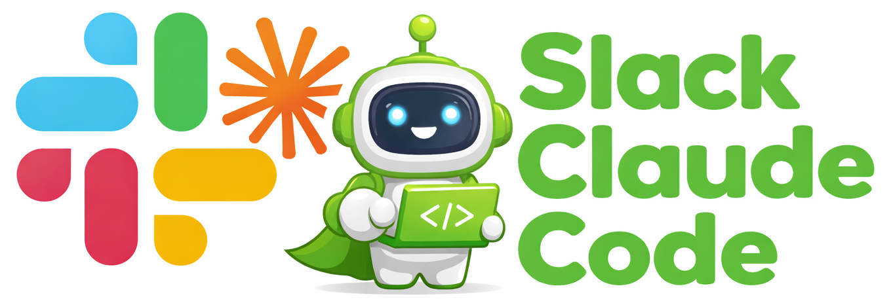

<p align="center">
  
</p>


**Claude Code, but in Slack.** Access Claude Code remotely from any device, or use it full-time for a better UI experience.

## Why Slack?

| Feature | Terminal | Slack |
|---------|----------|-------|
| **Code blocks** | Plain text | Syntax-highlighted with copy button |
| **Long output** | Scrolls off screen | "View Details" modal |
| **Permissions** | Y/n prompts | Approve/Deny buttons |
| **Parallel work** | Multiple terminals | Threads with isolated sessions |
| **File sharing** | `cat` or copy-paste | Drag & drop with preview |
| **Notifications** | Watch the terminal | Alerts when tasks complete |

All Claude Code commands work the same way: `/clear`, `/compact`, `/model`, `/mode`, `/add-dir`, `/review`, plus filesystem and git commands.

## Claude CLI Commands

| Command | Description |
|---------|-------------|
| `/init` | Initialize Claude project configuration |
| `/memory` | View/edit Claude's memory and context |
| `/review` | Review code changes with Claude |
| `/doctor` | Diagnose Claude Code installation issues |
| `/stats` | Show session statistics |
| `/context` | Display current context information |
| `/todos` | List and manage todos |

## Installation

### Prerequisites
- Python 3.10+
- [Claude Code CLI](https://github.com/anthropics/claude-code) installed and authenticated

### 1. Install dependencies
```bash
cd slack-claude-code
poetry install
```

### 2. Create Slack App
Go to https://api.slack.com/apps → "Create New App" → "From scratch"

**Socket Mode**: Enable and create an app-level token with `connections:write` scope (save the `xapp-` token)

**Bot Token Scopes** (OAuth & Permissions):
- `chat:write`, `commands`, `channels:history`, `app_mentions:read`, `files:write`

**Event Subscriptions**: Enable and add `message.channels`, `app_mention`

**App Icon**: In "Basic Information" → "Display Information", upload `claude_logo.png` from this repo as the app icon

**Slash Commands** (optional): Create commands like `/clear`, `/model`, `/ls`, `/cd`, `/status`, `/diff`, etc.

### 3. Configure and run
```bash
cp .env.example .env
# Add your tokens: SLACK_BOT_TOKEN, SLACK_APP_TOKEN, SLACK_SIGNING_SECRET
poetry run python run.py
```

## Usage

Type messages in any channel where the bot is present. Each Slack thread maintains an independent Claude session with its own working directory and context.

### Key Features

- **Threads = Sessions**: Each thread has isolated context; `/clear` only affects that thread
- **File Uploads**: Drag & drop files—Claude sees them instantly (code, images, PDFs)
- **Smart Context**: Frequently-used files are automatically included in prompts
- **Streaming**: Watch Claude's responses as they're generated

### Commands

| Category | Commands |
|----------|----------|
| **Session** | `/clear`, `/compact`, `/cost`, `/pty`, `/sessions`, `/session-cleanup` |
| **Navigation** | `/ls`, `/cd`, `/pwd`, `/add-dir` |
| **Git** | `/status`, `/diff`, `/commit`, `/branch` |
| **Config** | `/model`, `/mode`, `/permissions`, `/notifications` |
| **Queue** | `/q <cmd>`, `/qv`, `/qc`, `/qr <id>` |
| **Jobs** | `/st`, `/cc`, `/esc` |
| **Multi-Agent** | `/task`, `/tasks`, `/task-cancel` |

### Plan Mode

```
/mode plan
```

Claude creates a detailed plan before execution, shown with Approve/Reject buttons. Ideal for complex implementations where you want to review the approach first.

## Architecture

```
src/
├── app.py                 # Main entry point
├── config.py              # Configuration
├── database/              # SQLite persistence (models, migrations, repository)
├── claude/                # Claude CLI integration (executor, streaming)
├── pty/                   # PTY session management (session, pool, parser)
├── handlers/              # Slack command handlers
├── agents/                # Multi-agent orchestration (planner→worker→evaluator)
├── approval/              # Permission & plan approval handling
├── git/                   # Git operations (status, diff, commit, branch)
├── hooks/                 # Event hook system
├── question/              # AskUserQuestion tool support
├── tasks/                 # Background task management
└── utils/                 # Formatters, helpers, validators
```

## Configuration

Key environment variables (see `.env.example` for full list):

```bash
# Required
SLACK_BOT_TOKEN=xoxb-...
SLACK_APP_TOKEN=xapp-...
SLACK_SIGNING_SECRET=...

# Optional
DEFAULT_WORKING_DIR=/path/to/projects
COMMAND_TIMEOUT=300              # 5 min default
CLAUDE_PERMISSION_MODE=approve-all  # or: prompt, deny
AUTO_APPROVE_TOOLS=Read,Glob,Grep,LSP
```

## Troubleshooting

| Problem | Solution |
|---------|----------|
| Configuration errors on startup | Check `.env` has all required tokens |
| Commands not appearing | Verify slash commands in Slack app settings |
| Timeouts | Increase `COMMAND_TIMEOUT` |
| PTY session errors | Use `/pty` → "Restart Session" |

## License

MIT
